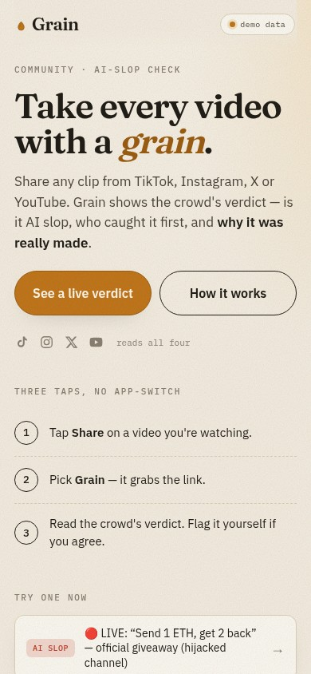
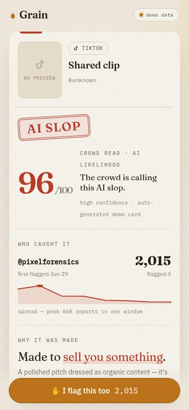

# Grain 🌾

**The crowd's read on any video.**

Share a clip from TikTok, Instagram, X or YouTube and get the community's
verdict — is it AI slop, who caught it first, how fast it spread, and why it
was made: to trick you, sell you something, farm your rage, or just entertain.

**Try it now:** https://grain-keithmichaelepk-9963s-projects.vercel.app

> Take every video with a grain.

  
  

## Why Grain exists

AI video is getting good — fast. The honest bet behind Grain: soon it will be
undetectable to the human eye, and everyone (including the skeptics who swear
they can't be fooled) will need something better than their gut. Grain's answer
is crowd-first: the community's collective read, with provenance signals as a
hint, not a verdict.

If it also starts a few conversations about what "safe online" means now —
even better.

## How to use it

No app store, no account:

- **Check a video** — share or paste any link and get the crowd's read.
  - iPhone: a 2-minute Shortcut puts Grain in your Share sheet.
    [Setup guide](docs/share-sheet-setup.md)
  - Android: install Grain from Chrome (Add to Home screen) — it appears in
    your native share sheet.
  - Anywhere: paste a link at the site.
- **Play the Daily Grain Check** — five clips a day, real or AI, swipe to
  guess and see if you can beat the crowd. Open `/play` — no account needed to
  start. [How it works](docs/how-it-works.md)

## Honesty, up front

The live demo runs on **seeded, simulated crowd data** while the community
layer is built. Every card carries a visible demo-data badge, and the data
model marks every source. Details: [docs/honesty.md](docs/honesty.md)

## Feedback

This is being built in the open, even though the source is private for now:

- 🐞 [Report a bug](../../issues/new?template=bug_report.yml)
- 💡 [Suggest a feature](../../issues/new?template=feature_request.yml)
- ⚖️ [Dispute a verdict](../../issues/new?template=verdict_dispute.yml)
- 📣 Releases + changelog: [Releases](../../releases) · [CHANGELOG](CHANGELOG.md)

Roadmap: [docs/roadmap.md](docs/roadmap.md)
